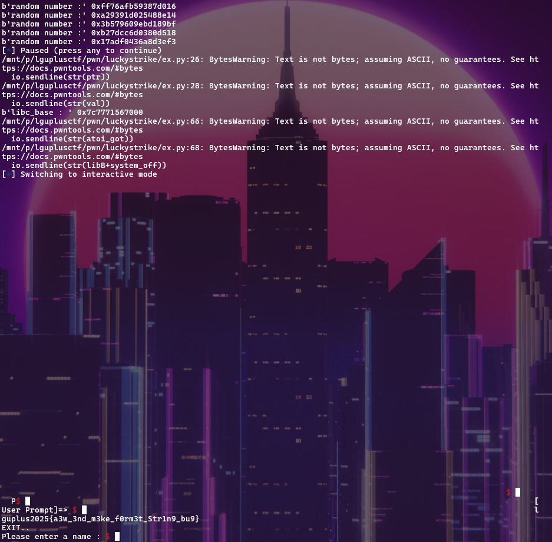

# Lucky Strike
- Pwn

## [1] Mitigation
  Arch:       amd64-64-little
  RELRO:      Partial RELRO
  Stack:      Canary found
  NX:         NX enabled
  PIE:        No PIE (0x400000)
  SHSTK:      Enabled
  IBT:        Enabled
  
## [2] Flow
Unlike menu options 1, 2, and 3, selecting option 4100 enables AAR.
To trigger this, I first needed to know the rand value and win the game to accumulate enough points.
Fortunately, leveraging a format string %s, I was able to leak the rand value.

Aiming to spawn a shell, I proceeded to leak the base address of GLIBC mapped into the process. 
Overwrote the GOT entry of atoi() with the PLT address of printf(), the argument passed to atoi() is directly controlled by user input.

Before performing the GOT overwrite, I patched the GOT entry of exit() with the starting address of main(). 
This not only prevented the process from terminating due to invalid menu selections, but also bypassed the one-time restriction on AAW via option 4100-effectively forcing the process to restart and allowing repeated exploitation.

Using format strings like %p%p%p or %3$p, I was able to leak a GLIBC address.

The buffer in question was QWORD[2], which made AAR via format string bugs more challenging. 
For example, crafting something like %<position>$p<Address> requires precise placement, and fitting this into a 16-byte space is difficult.

To overcome this, I crafted %4100c to make printf() return 4100, thereby re-enabling the AAR functionality.

Finally, replacing the GOT entry of atoi()-which had previously been redirected to printf()-with the address of system() completed the exploit.

